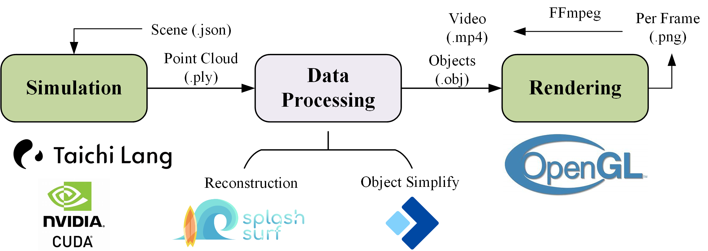

# Fluid Simulation rendered by OpenGL RayTracing

This is my course project of EDAN35 - High Performance Computer Graphics in LTH, Lund University. The output video is shown below. If you want to have a more comprehensive understanding of my project, please watch the [video](https://youtu.be/Mn7XGw7X23k). 

## Workflow

The workflow diagram is shown below. It mainly consists of 3 steps. The simulation phase comes first. It is supported by [Taichi Language](https://www.taichi-lang.org/), which is a domain-specific language embedded in Python to call CUDA that helps users easily write parallel programs running on GPU. I implemented one basic fluid simulation algorithm, [WCSPH](https://dl.acm.org/doi/10.5555/1272690.1272719). The output of this step is .ply files containing positions of particles. Next is the data processing phase. It relies on [SplashSurf](https://github.com/InteractiveComputerGraphics/splashsurf) to reconstruct objects and [OBJ Simplifier](https://simplify.nsdt.cloud/?) to simplify objects (The simplification is needed because my hardware is limited and the rendering process is not optimized enough. If you don't have these problems, this step can be ignored). The final phase is rendering. I implemented a ray tracer based on OpenGL, putting all the ray color calculations on the fragment shader, expanding recursion into loop, using texture to store and transfer large volume of data. By synthesizing the rendered images into a video, we can get the final result.

## Reference

[Taichi Lang: High-performance Parallel Programming in Python (taichi-lang.org)](https://www.taichi-lang.org/)

https://github.com/erizmr/SPH_Taichi

https://github.com/jason-huang03/SPH_Project

https://github.com/carl-vbn/opengl-raytracing/tree/main

https://github.com/AKGWSB/EzRT/tree/main